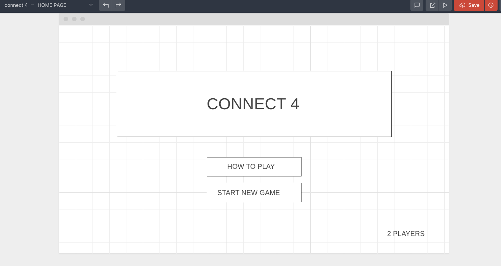
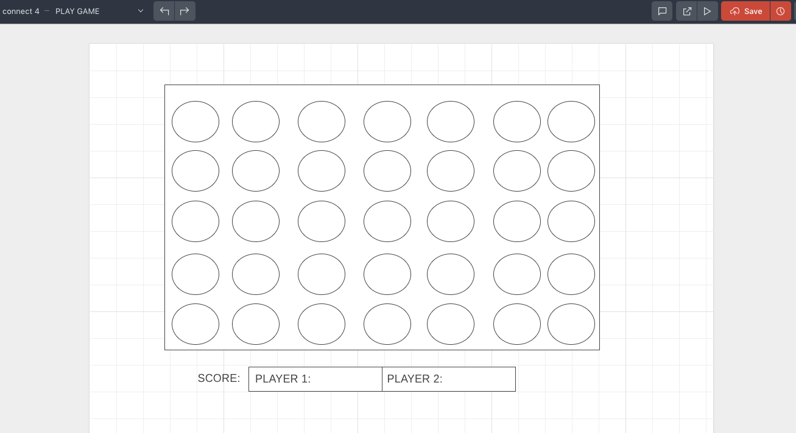
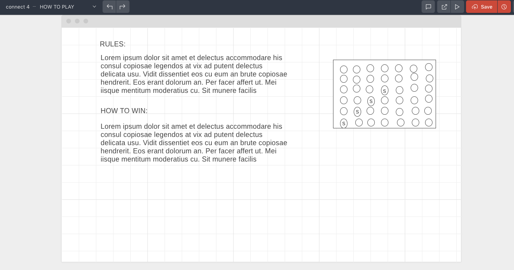

# CONNECT 4: the online game
## Object of the game:

- A player must connect 4 of their game pieces horizontal, vertical, diagonal-up, or diagonal-down in order to win a game.

## How to play:

- Connect 4 is a 2 player game. To play the game, select the "New Game" button to take you to the game page. In the game page select the "Start Game" button to begin.
Each player, starting with player 1, will take turns dropping their game piece into any column of the game board. Each piece will fill an empty spot on the board and stack on top of previously dropped pieces. The player who is first to connect 4 of their pieces, again this can be horizontal, vertical, or diagonal, wins this game!
## Scoring:
- Both players begin with no points. When a player wins, the score board will update to reflect the point won for the game. 
## Play Again:
1. If you would like to play again press the "Start Game" button to begin. You can play as many times as you'd like and watch your score go up.
2. If you would like to start a completely new game with score 0-0, then press "Reset Score" and the score board will be cleared and the game reset.

### Wireframe images

- Home Page:

- Game Page:

- Instruction Page:

### Link to Trello Project Board
- https://trello.com/b/Tcm2kogp/project-1-game